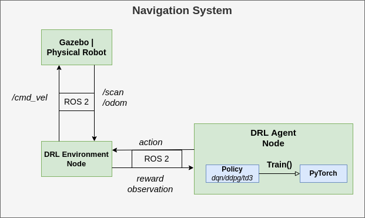

# Mobile Robot DRL Navigation

### A ROS2 framework for DRL autonomous navigation on mobile robots with LiDAR.
<p float="left">
 
 
</p>


# **Table of contents**
* [Introduction](#introduction)
* [Installation](#installation)
  * [Docker Installation (recommended)](#docker-installation-recommended)
  * [Manual Installation](#manual-installation)
* [Training](#training)
  * [Loading a Stored Model](#loading-a-stored-model)
  * [Optional Configuration](#optional-configuration)
  * [Utilities](#utilities)
* [Physical Robot](#physical-robot)
* [Troubleshooting](#troubleshooting)

# **Introduction**

This repository contains a ROS2 and PyTorch framework for developing and experimenting with deep reinforcement learning for autonomous navigation on mobile robots. Models are trained in simulation and evaluated either in simulation or on a real-world robot. The robot model used in this repository is based on the turtlebot3. However, the framework can be used for any robot model that can provide LiDAR and odometry information and work with linear velocity messages.

Below are a few examples of what the current framework can be used for:

* Train, store, load, and evaluate a navigation agent in simulation in different environments
* Deploy an existing model on a real robot to perform navigation and obstacle avoidance
* Evaluate the effect of different hyperparameters on training time and performance
* Experiment with additional capabilities (backward motion, frame stacking)
* Implement your own DRL algorithm (currently includes: DQN, DDPG, TD3)

# **Installation**

# **Docker Installation (Recommended)**

In order to greatly simplify the installation process and get up and running quickly it is recommended to use Docker. Docker can be seen as a lightweight VM that allows you to run applications within an isolated container making it easy to install all of the dependencies.

First, [install docker](https://docs.docker.com/engine/install/ubuntu/)

Now, in order to use your GPU within the docker container to run the machine learning models, we need to complete a few extra simple steps.
You should already have the nvidia driver installed on your system.


## **Nvidia Container Toolkit**

The next thing we need to do is install the [nvidia container toolkit](https://docs.nvidia.com/datacenter/cloud-native/container-toolkit/overview.html) which is a piece of software that will allow us to use our GPU within the docker container. The installation steps are listed below.

First, setup the package repository and the GPG key:

```
distribution=$(. /etc/os-release;echo $ID$VERSION_ID) \
      && curl -fsSL https://nvidia.github.io/libnvidia-container/gpgkey | sudo gpg --dearmor -o /usr/share/keyrings/nvidia-container-toolkit-keyring.gpg \
      && curl -s -L https://nvidia.github.io/libnvidia-container/$distribution/libnvidia-container.list | \
            sed 's#deb https://#deb [signed-by=/usr/share/keyrings/nvidia-container-toolkit-keyring.gpg] https://#g' | \
            sudo tee /etc/apt/sources.list.d/nvidia-container-toolkit.list
```

Then install the container toolkit:
```
sudo apt-get update && sudo apt-get install -y nvidia-container-toolkit
```

Configure the Docker daemon to recognize the NVIDIA Container Runtime:
```
sudo nvidia-ctk runtime configure --runtime=docker
```

And lastly, restart the Docker daemon to complete the installation after setting the default runtime:
```
sudo systemctl restart docker
```

At this point, a working setup can be tested by running a base CUDA container:
```
sudo docker run --rm --runtime=nvidia --gpus all nvidia/cuda:11.6.2-base-ubuntu20.04 nvidia-smi
```
## **Build and run container**

Now build the container specified in the Dockerfile, which may take 10-20 minutes:

```
docker build -t turtlebot3_drlnav .
```

Lastly, we need to give our docker container permission to run GUIs:

```
xhost +local:docker
```

Now that everything is set up, start the container: <br>
(Replace `/PATH/TO/REPO` with the path where you downloaded this repository on your machine)
```
docker run -it --gpus all --privileged   --env NVIDIA_VISIBLE_DEVICES=all   --env NVIDIA_DRIVER_CAPABILITIES=all  --env DISPLAY=${DISPLAY}  --env QT_X11_NO_MITSHM=1  --volume /tmp/.X11-unix:/tmp/.X11-unix -v /PATH/TO/REPO/turtlebot3_drlnav:/home/turtlebot3_drlnav   --network host turtlebot3_drlnav
```
And that's it! we don't need to install any other dependencies thanks to docker.

While inside the container first build our application:
```
colcon build
```
And then source our packages:
```
source install/setup.bash
```

Now you are ready to skip to the [Training](#training) section and run the application.

# **Manual Installation**

If you don't want to use docker you can install all dependencies manually.

## **Dependencies**

*   Ubuntu 20.04 LTS (Focal Fossa) [download](https://releases.ubuntu.com/20.04)
*   ROS2 Foxy Fitzroy
*   Gazebo (Version 11.0)
*   PyTorch (Version: 1.10.0)


## **Installing ROS2**
Install ROS2 foxy according to the following guide: [link](https://docs.ros.org/en/foxy/Installation/Ubuntu-Install-Debians.html). You can choose either the Desktop or Bare Bones ROS installation, both work. <br>
To prevent having to manually source the setup script every time, add the following line at the end of your `~/.bashrc` file:

```
source /opt/ros/foxy/setup.bash
```

More detailed installation instructions can be found [here](https://automaticaddison.com/how-to-install-ros-2-foxy-fitzroy-on-ubuntu-linux/).


## **Installing Gazebo**

For this project we will be using Gazebo **11.0.** To install Gazebo 11.0, navigate to the following [page](http://gazebosim.org/tutorials?tut=install_ubuntu), select Version 11.0 in the top-right corner and follow the default installation instructions.

Next, we need to install a package that allows ROS2 to interface with Gazebo.
To install this package we simply execute the following command in a terminal:
```
sudo apt install ros-foxy-gazebo-ros-pkgs
```
After successful installation we are now going to test our ROS2 + Gazebo setup by making a demo model move in the simulator. First, install two additional packages for demo purposes (they might already be installed):
```
sudo apt install ros-foxy-ros-core ros-foxy-geometry2
```
Source ROS2 before we launch the demo:
```
source /opt/ros/foxy/setup.bash
```

Now, let's load the demo model in gazebo:
```
gazebo --verbose /opt/ros/foxy/share/gazebo_plugins/worlds/gazebo_ros_diff_drive_demo.world
```
This should launch the Gazebo GUI with a simple vehicle model. Open a second terminal and provide the following command to make the vehicle move:
```
ros2 topic pub /demo/cmd_demo geometry_msgs/Twist '{linear: {x: 1.0}}' -1
```
If the vehicle starts moving forward we confirmed that the Gazebo-ROS connection works.
If something does not work, carefully check whether you executed all the commands and sourced ROS2 (`source /opt/ros/foxy/setup.bash`). You can also check the more detailed [guide](https://automaticaddison.com/how-to-install-ros-2-foxy-fitzroy-on-ubuntu-linux/).

## **Installing Python3, Pytorch**

If you are using Ubuntu 20.04 as specified, Python should already be preinstalled. The last tested version for this project was Python 3.8.10

Install pip3 (python package manager for python 3) as follows:
```
sudo apt install python3-pip
```

To install the tested version of PyTorch (1.10.0) with CUDA support (11.3) and packages for generating graphs, run:
```
pip3 install matplotlib pandas pyqtgraph==0.12.4 PyQt5==5.14.1 torch==1.10.0+cu113 -f https://download.pytorch.org/whl/cu113/torch_stable.html
```

`pyqtgraph` and `PyQt` are optional and only necessary if you want to visualize the neural network activity. `pandas` is only required for generating graphs outside of training.

**Note: The version of CUDA support to install will depend on the [compute capability](https://developer.nvidia.com/cuda-gpus) of your GPU**

## **Enabling GPU support (recommended)**

We can significantly speed up the training procedure by making use of a GPU. If no GPU is available or it is not initialized correctly the training will automatically be redirected to the CPU. Since most users have access to an NVIDIA GPU we will explain how to enable this to work with PyTorch on linux.
Three different components are required to train on GPU:
- NVIDIA drivers for linux
- The CUDA library for linux
- cuDNN (comes with pytorch and should be installed automatically)

Press the windows/command key and type "Additional drivers" to make the corresponding linux menu come up. Here, multiple radio button options should be listed for installing different nvidia drivers. Install the option with the latest version (highest number, e.g. currently nvidia-driver-510).

The next step is to download the correct CUDA version. This will depend on your NVIDIA drivers and GPU variant. Generally, all you have to do is execute:
```
sudo apt install nvidia-cuda-toolkit
```
You can then verify that CUDA is installed using:
```
nvcc -V
```
and
```
nvidia-smi
```
Which should display version numbers and GPU information.
In case of doubt, consult one of the following resources: [one](https://varhowto.com/install-pytorch-ubuntu-20-04/), [two](https://pytorch.org/get-started/locally/), [three](https://docs.nvidia.com/deploy/cuda-compatibility/index.html)

## **Downloading the code base and building**
<!-- Now it's time to create a workspace that will serve as the basis for our project. To do this, follow the tutorial [here](https://automaticaddison.com/how-to-create-a-workspace-ros-2-foxy-fitzroy/) -->

Now it's time to download the repository to the actual code.

Since ROS2 does not yet support metapackages, we will have to download the whole workspace from Git.

First, make sure you have the `turtlebot3-description` package by running:
```
sudo apt-get install ros-foxy-turtlebot3-description
```

Open a terminal in the desired location for the new workspace. Clone the repository using:
```
git clone https://github.com/tomasvr/turtlebot3_drlnav.git
```

`cd` into the directory and make sure you are on the main branch
```
cd turtlebot3_drlnav
git checkout main
```

Next, install the correct rosdep tool
```
sudo apt install python3-rosdep2
```

Then initialize rosdep by running
```
rosdep update
```

Now we can use rosdep to install all ROS packages needed by our repository
```
rosdep install -i --from-path src --rosdistro foxy -y
```

Now that we have all of the packages in place it is time to build the repository. First update your package list
```
sudo apt update
```

Then install the build tool **colcon** which we will use to build our ROS2 package
```
sudo apt install python3-colcon-common-extensions
```

Next, it's time to actually build the repository code!
```
colcon build
```
After colcon has finished building source the repository
```
source install/setup.bash
```

The last thing we need to do before running the code is add a few lines to our `~/.bashrc` file so that they are automatically executed whenever we open a new terminal. Add the following lines at the end of your `~/.bashrc` file and **replace ~/path/to/turtlebot3_drlnav/repo with the path where you cloned the repository. (e.g. ~/turtlebot3_drlnav)**
```
# ROS2 domain id for network communication, machines with the same ID will receive each others' messages
export ROS_DOMAIN_ID=1

# Fill in the path to where you cloned the turtlebot3_drlnav repo
WORKSPACE_DIR=~/path/to/turtlebot3_drlnav
export DRLNAV_BASE_PATH=$WORKSPACE_DIR

# Source the workspace
source $WORKSPACE_DIR/install/setup.bash

# Allow gazebo to find our turtlebot3 models
export GAZEBO_MODEL_PATH=$GAZEBO_MODEL_PATH:$WORKSPACE_DIR/src/turtlebot3_simulations/turtlebot3_gazebo/models

# Select which turtlebot3 model we will be using (default: burger, waffle, waffle_pi)
export TURTLEBOT3_MODEL=burger

# Allow Gazebo to find the plugin for moving the obstacles
export GAZEBO_PLUGIN_PATH=$GAZEBO_PLUGIN_PATH:$WORKSPACE_DIR/src/turtlebot3_simulations/turtlebot3_gazebo/models/turtlebot3_drl_world/obstacle_plugin/lib
```

For more detailed instructions on ros workspaces check [this guide](https://automaticaddison.com/how-to-create-a-workspace-ros-2-foxy-fitzroy/).

**Note: Always make sure to first run ```source install/setup.bash``` or open a fresh terminal after building with `colcon build`.**

# **Training**



## **Running and training the DRL agent!**

Now that we have finally completed the setup, all that's left to do is run and train the agent.

Open up four different terminals however you like (I recommended using `terminator` or `tmux` for multi-tab). In the first terminal run
```
ros2 launch turtlebot3_gazebo turtlebot3_drl_stage4.launch.py
```
You should see the gazebo GUI come up with the robot model loaded and two moving obstacles (this might take a while to load).
**Note: make sure to run the 'launch' command first before any other nodes as it will set the stage parameter.**

In a second terminal run
```
ros2 run turtlebot3_drl gazebo_goals
```

In a third terminal run
```
ros2 run turtlebot3_drl environment
```

And lastly, in the fourth terminal run the ddpg agent
For DDPG:
```
ros2 run turtlebot3_drl train_agent ddpg
```

The first argument indicates whether we are testing or training (0 = testing, 1 = training)

<!-- *optional arguments:*
- The second argument indicates the name of the model if we are continuing training (e.g. "path/to/model/ddpg_1")
- The third argument indicates from which episode to continue training -->

for TD3:
```
ros2 run turtlebot3_drl train_agent td3
```

for DQN:
```
ros2 run turtlebot3_drl train_agent dqn
```

Your robot should now be moving and training progress is being printed to the terminals!

**Note**: The matplotlib graph will initially be empty but will be displayed after the first `GRAPH_DRAW_INTERVAL` episodes configured in `settings.py`. During testing, terminal output is used instead of the graph.

The state of your model will be stored automatically every `STORE_MODEL_INTERVAL` episodes configured in `settings.py`.
You will find the trained model, logfiles, and graphs in the model directory: `model/[HOSTNAME]/[MODEL_NAME]`. Training results per episode are stored in a sequential text file.

Now you have everything up and running to train your model. There are several additional options and utilities available for training which will be discussed below.

## Loading a stored model

The current state of the agent (weights, parameters, replay buffer, and graphs) will be stored automatically every N episodes as configured by the `store_interval` variable in the `common/settings.py` file.

In order to load a model for testing (e.g. ddpg_0 at episode 500) the following command should be used:

```
ros2 run turtlebot3_drl test_agent ddpg "ddpg_0" 500
```

In order to load a model to continue training (e.g. ddpg_0 at episode 500) the following command should be used:

```
ros2 run turtlebot3_drl train_agent ddpg "ddpg_0" 500
```

**Note:** You can also test (or continue training) a model on a different stage than where it was originally trained on.

### Loading one of the included example models

Two examples are included for a DDPG and TD3 model. In order to run them, open four terminals like before and run:

Terminal 1:
```
ros2 launch turtlebot3_gazebo turtlebot3_drl_stage9.launch.py
```

Terminal 2:
```
ros2 run turtlebot3_drl gazebo_goals
```

Terminal 3:
```
ros2 run turtlebot3_drl environment
```

Terminal 4:
For DDPG:
```
ros2 run turtlebot3_drl test_agent ddpg 'examples/ddpg_0' 8000
```

Or, for TD3
```
ros2 run turtlebot3_drl test_agent td3 'examples/td3_0' 7400
```

You should then see the example model navigate successfully toward the goal

### Switching environments

You can switch between 10 different environments by changing the stage number in the launch command:
```
ros2 launch turtlebot3_gazebo turtlebot3_drl_stage5.launch.py
```

change `stage5` to any stage between 1-10 to train on different environments.

## **Optional Configuration**

### Settings: change parameters

The `settings.py` file contains most of the interesting parameters that you might wish to change, including the DRL hyperparameters.

### Reward: tweak reward design

The `reward.py` file contains the reward design. Here you can implement different reward functions between which you can switch in the `settings.py` file. For example, to define a new reward function `"B"` you simply add `get_reward_B(...)` to `reward.py` and define the reward per step.

### Backward motion

To enable the robot to also move in the backward direction simply set `ENABLE_BACKWARD` to `True` in `settings.py`.

### Stacking

'Frame stacking' can enable the robot to consider the direction in which obstacles are moving. The robot considers multiple subsequent laser scan frames instead of a single frame at each step. To enable frame stacking, set `ENABLE_STACKING` to `True` in `settings.py`. Also define `STACK_DEPTH` (number of frames per step) and `FRAME_SKIP` (number of frames to skip between two frames in the stack).

## **Utilities**
### Graph Generation

In order to compare results the repository includes a script that graphs the reward curves for different models. The script `reward_graph.py` can be found in the `util` directory.

To compare the reward curve for `ddpg_0` and `td3_0` every 100 episodes we type:
```
python3 util/reward_graph.py 100 examples/ddpg_0 examples/td3_0
```

Again, `examples/` should not be included in the path for your own models.

**Note: graph generation will only work correctly if training has not been stopped and continued. Otherwise you first need to merge the different _train_stage*.txt files into a single file**

### Cleaning model data

Training models can generate a lot of data, especially if you save the model often. In order to automatically clean models to save space, two cleaning scripts are included in the `util` folder.

**CAUTION: use the following scripts with caution as deleted data cannot be retrieved! Carefully examine the script settings and double-check the command line arguments you enter**

The following line will clean ddpg_0 removing all saved model states except:
* The model state for the 4 best-performing episodes
* The model state for the most recent episode
`python3 util/clean_single_model.py ddpg_0`

If you want to keep more or less data you can adjust the `TOP_EPISODES` parameters in the script itself.

To clean all of the models at once you can use the `purge_all_models.py` script. Carefully check the parameters at the top of the file before executing the script. To execute the script simply type:
```python3 util/purge_all_models.py```

The script will loop through all of your models and select the models to keep like explained above. In addition, models which scored too low or were trained for too few episodes will be removed completely (threshold specified in `purge_all_models.py`).

### Visualization


To enable a complete visualization of the neural network neuron activity and biases simply set `ENABLE_VISUAL` to `True` in `settings.py`. This requires the python3 packages `pyqtgraph` and `PyQt5` to be installed.
The visual should mainly be used during evaluation as it can slow down training significantly.
## Command Specification

**train_agent:**

```ros2 run turtlebot3_drl train_agent [algorithm=dqn/ddpg/td3] [loadmodel=\path\to\model] [loadepisode=episode] ```

* `algorithm`: algorithm to run, one of either: `dqn`, `ddpg`, `td3`
* `modelpath`: path to the model to be loaded to continue training
* `loadepisode`: is the episode to load from `modelpath`

**test_agent:**

```ros2 run turtlebot3_drl test_agent [algorithm=dqn/ddpg/td3] [loadmodel=\path\to\model] [loadepisode=episode] ```

* `algorithm`: algorithm to run, one of either: `dqn`, `ddpg`, `td3`
* `modelpath`: path to model to be loaded for testing
* `loadepisode`: is the episode to load from `modelpath`

# Physical Robot

The models trained using this framework were validated on a low-cost physical system. Video demonstrations can be found on my [YouTube channel](https://www.youtube.com/@tomasvr1/videos).


The are three main requirements for a robot to be compatible with this project:
* The robot needs to provide LiDAR scan information
* The robot needs to provide any kind of odometry information (e.g. tachometers, SLAM, AMCL or GPS)
* The robot needs to be able to work with linear and angular velocity messages

To run one of your models (trained in simulation) on a physical robot follow these steps:
* In settings.py, adjust the REAL ROBOT ENVIRONMENT SETTINGS
  * **REAL_TOPIC**: Set the right ROS topics for your laser scan, odometry and velocity inputs/outputs
  * **REAL_N_SCAN_SAMPLES**: Configure the number of Lidar samples your robot will provide
  * **REAL_LIDAR_CORRECTION**: Depending on the dimensions of your robot the LiDAR values might need to be corrected to avoid the agent from detecting a 'collision' when the robot has not yet actually collided with any obstacle. This value is simply subtracted from the real LiDAR readings and finding the right value requires some trial and error.
  * Set the remaining options such as the arena dimensions, max velocities, max LiDAR distance, and goal and collision thresholds.

Next, when using a physical robot we do not need to run the gazebo simulation node or the gazebo_goals node. We will however still need to run an environment node and an agent node.

At this point, turn on the robot and initialize all of its components. Ensure that:
* LiDAR scan ROS messages are being sent over the configured TOPIC_SCAN topic
* Odometry ROS messages are being sent over the TOPIC_ODOM topic
* The robot is listening for velocity ROS messages on the TOPIC_VELO topic.

**Note:** If you are running nodes on multiple machines (e.g. one laptop and one robot) ensure that all machines have the same value set for `ROS_DOMAIN_ID` in `~/.bashrc`:

`export ROS_DOMAIN_ID=[X]` (X can be any number as long as it is the same for each machine).

Also ensure that all machines are connected to the same Local Area Network (LAN).

Now, open a terminal on your laptop (or robot) and run the environment node for a real robot:
```
ros2 run turtlebot3_drl real_environment
```

Then, open another terminal and run the agent node for a real robot (substitute your model name and desired episode to load):
```
ros2 run turtlebot3_drl real_agent [ALGORITHM_NAME] [MODEL_NAME] [MODEL_EPISODE]
```
For example:
```
ros2 run turtlebot3_drl real_agent ddpg ddpg_1_stage4 1000
```

If everything loads correctly, you can now use the included script to generate a goal at location (x=1, y=1):
```
./spawn_goal 1 1
```

**And that's it!** You should now see the robot start moving toward the goal while avoiding obstacles.

**Note:** You can use RViz2 in order to visualize the LiDAR scans for debugging and fine-tuning the REAL_LIDAR_CORRECTION value: simply add a `laser_scan` display type and set its topic to `TOPIC_SCAN`.

# **Troubleshooting**

## **bash: /opt/ros/foxy/setup.bash: No such file or directory**

Depending on your installation method of ROS, it might be required to add the following line to your `~/bashrc` file:
```
source ~/ros2_foxy/ros2-linux/setup.bash
```
Also, make sure that you source the correct setup files in your `~/.bashrc` as described in the installation section of this guide.

## **Package 'turtlebot3_gazebo' not found: "package 'turtlebot3_gazebo' not found, searching: ['/opt/ros/foxy']"**

Make sure to run `source install/setup.bash` from the root of the repository in every terminal every time after you build the project using `colcon_build`. Otherwise, the nodes will not run the updated version of your code but the old version from the last time you built and sourced.
